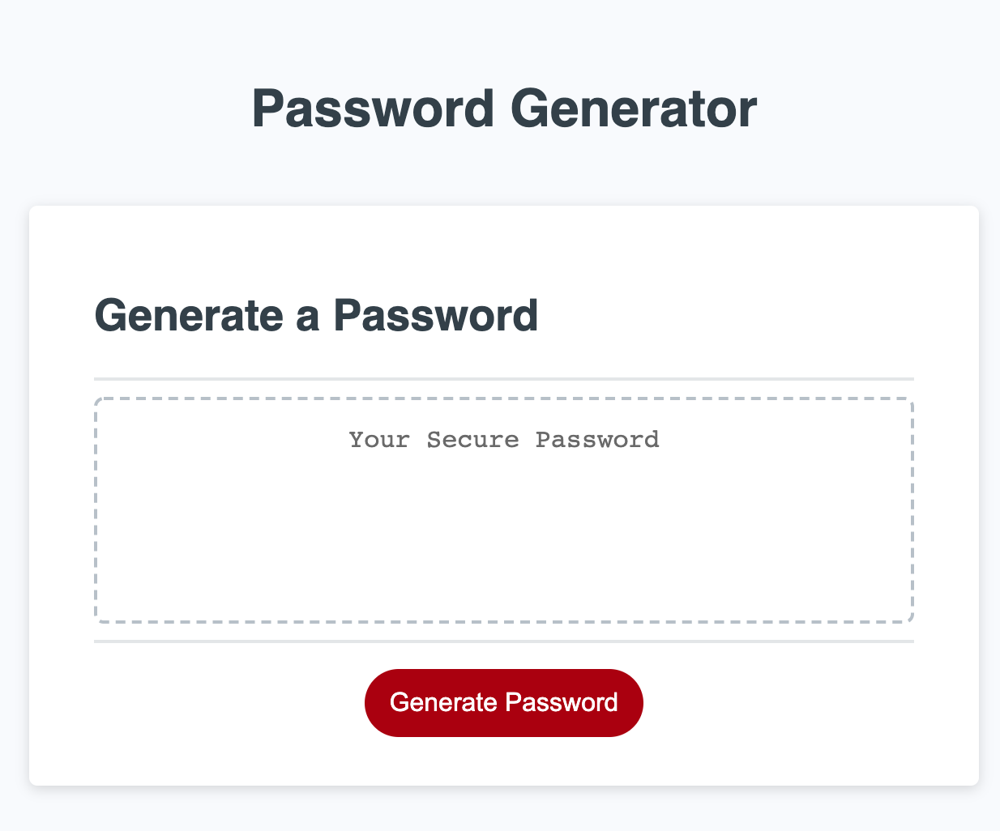

# pwgenerator
Building a PW generator in Javascript

## Someone suggested building a Password Generator, because it was a good tool to have.

### This project was a true test of attrition for me. I had to use every skill I have obtained to complete it; additionally, I had to look up and learn a mountain of information. The hardest part was learning how to identify bugs, and ultimately fix them.

#### The project was delivered with a variable, a function and an execution. I was not sure what any of these were so I had to look up an incredible amount of information to complete the project.

#### The following items are listed as they appear in my script.js.

	* variables (var)
		A box that "holds data."
	* let
		Like var, but more restrictive.
	* arrays
		Stores multiple values in a single variable.
		Or a collection of Variables of the same type
	* method
		Is a property of an object. Or object reference to a property. 
	* function
		Is a set of data that performs a task.
	* DOM
		Hiarchy of a webpage in this case used to access an element on the website.
	* if
		Condition is true do this
	* else if
		Condition is false, do this.
	* prompt
		Diplays a dialogue, which allows the user to interact.
	* parseInt
		Parses a string and returns an integer
	* console.log
		Print a data to be displayed to the user.
	* return
		Returns the value of the data.
	* length
		Returns the length of a string
	* for loop
		Repeats a condition till evaluates to false.
	* addEventListenter
		Attaches to the specified element without overwriting

This project allowed me to understand how Javascript is used to prompt the user, and get information from the user to control the outcome of their choices. So far this project was by far the most challenging because I am so new to object-oriented programming; however, I learned a lot from it, and will surely use the skills, and most of all the logic on future projects.

https://greezon.github.io/pwgenerator/index.html

## Contributing
Pull requests are welcome. I will not be reviewing any changes from any unknown source.

## License
[MIT](https://choosealicense.com/licenses/mit/)

